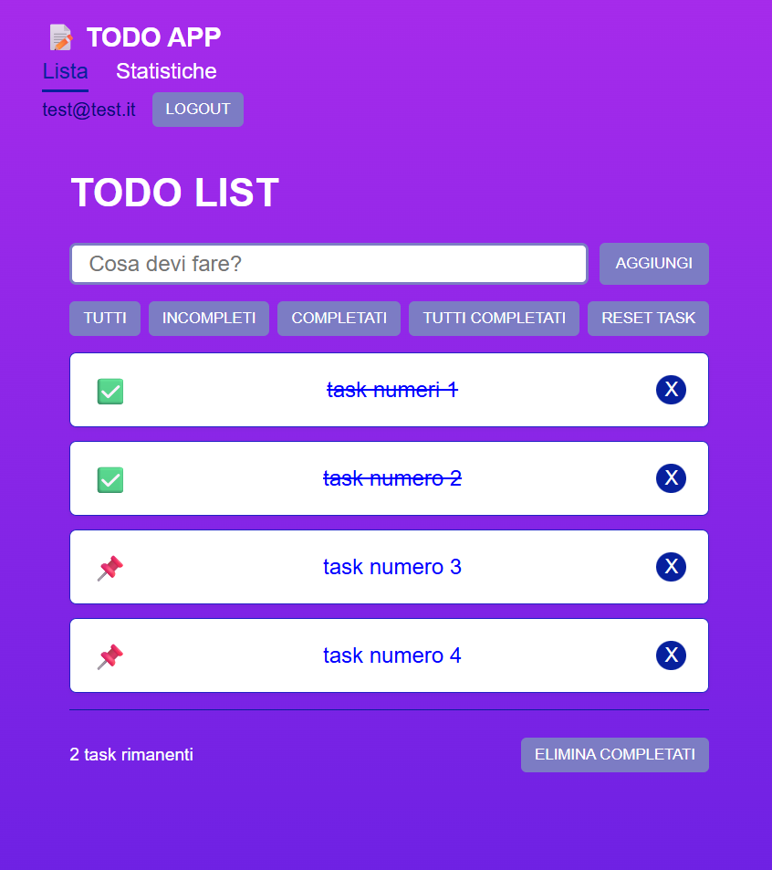
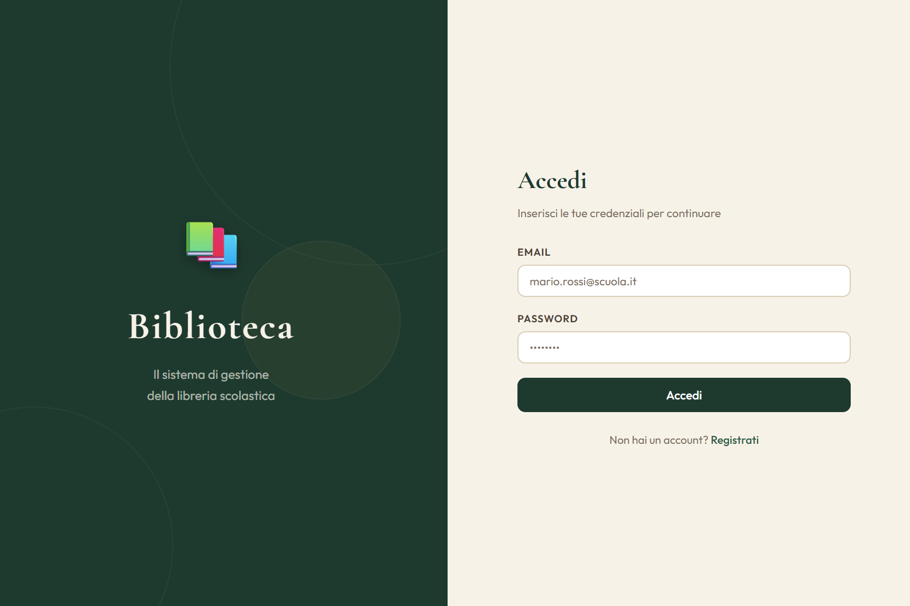

# 🚀 React Complete Course — Guida Pratica Full-Stack

[](https://reactjs.org/)
[](https://nodejs.org/)
[](https://www.postgresql.org/)
[](https://expressjs.com/)

> **Corso completo React da zero a hero**: dalle basi ai concetti avanzati, con progetti pratici e backend integrato. Materiale didattico professionale per sviluppatori e docenti.

---

## 📚 Panoramica

Materiale didattico completo per imparare React e lo sviluppo full-stack moderno. Ogni lezione include teoria, esempi pratici, codice completo e progetti reali. Perfetto per **autodidatti**, **bootcamp** e **docenti** che cercano materiale strutturato.

### ✨ Caratteristiche

- ✅ **Approccio pratico** — ogni concetto è applicato a progetti reali
- ✅ **Problem-first pedagogy** — mostra il problema prima della soluzione
- ✅ **Codice production-ready** — best practices e pattern professionali
- ✅ **Backend integrato** — REST API con Express e PostgreSQL
- ✅ **Step-by-step** — istruzioni dettagliate per ogni riga di codice
- ✅ **Doppia documentazione** — guide pratiche + spiegazioni teoriche approfondite

---

## 🎯 Cosa Imparerai

### Frontend
React • Hooks (useState, useEffect, useRef, useContext) • Component Lifecycle • Props & State • Form Handling • React Router • Context API • Custom Hooks • JWT Authentication • Protected Routes

### Backend
Node.js • Express.js • RESTful API • PostgreSQL • SQL Queries • bcrypt Password Hashing • JWT Tokens • Middleware Pattern • CORS • Error Handling

### Tools & Deployment
Vite • npm/npx • Git/GitHub • DBeaver • Postman • Vercel Deployment

## 📸 Screenshots




---

## 📖 Struttura del Corso

### 📘 Lezione 1 — Fondamenti React
**Durata**: ~2 ore

**Argomenti**:
- Cos'è React e perché usarlo
- JSX e componenti
- Props (passare dati tra componenti)
- `useState` (stato reattivo)
- Rendering condizionale
- Eventi (`onClick`, `onChange`)

**Progetto**: Contatore interattivo + Todo List base

**File inclusi**:
- `lezione1-fondamenti-react.md` — guida pratica step-by-step
- Codice completo del progetto

---

### 📘 Lezione 2 — Liste, Eventi e Form
**Durata**: ~2 ore

**Argomenti**:
- Renderizzare liste con `.map()`
- Gestione key in React
- Form controllati (controlled components)
- Validazione input
- State lifting (sollevare lo stato)
- Composizione di componenti

**Progetto**: Todo List completa con filtri, toggle, eliminazione

**File inclusi**:
- `lezione2-liste-form.md` — guida pratica
- Componenti TodoItem, TodoList, TodoInput, TodoFiltri

---

### 📘 Lezione 3 — useEffect & Backend Integration
**Durata**: ~2.5 ore

**Argomenti**:
- `useEffect` (side effects)
- Lifecycle: mount, update, unmount
- Cleanup functions
- Fetch API e chiamate asincrone
- REST API con Express e PostgreSQL
- CORS
- Database setup (PostgreSQL + DBeaver)

**Progetto**: Todo List con persistenza database

**File inclusi**:
- `lezione3-useeffect-backend.md` — guida pratica
- Backend Express completo (`todo-backend/`)
- Frontend integrato con API

---

### 📘 Lezione 4 — React Router & Multi-Page Apps
**Durata**: ~2 ore

**Argomenti**:
- React Router (BrowserRouter, Routes, Route)
- Link e NavLink (navigazione senza reload)
- Parametri dinamici (`:id`) e `useParams`
- `useNavigate` (navigazione programmatica)
- Layout e Outlet (route annidate)
- Protected routes

**Progetto**: Todo List multi-pagina (lista, dettaglio task, statistiche, 404)

**File inclusi**:
- `lezione4-liste-router.md` — guida pratica
- Layout condiviso con navbar
- Pagine: TodoPage, DettaglioTask, StatsPage, NotFound

---

### 📘 Lezione 5 — JWT Authentication & Context API
**Durata**: ~2 ore

**Argomenti**:
- JWT (JSON Web Token) — teoria e pratica
- bcrypt per hash password
- Middleware di autenticazione
- Context API (stato globale)
- Custom hooks (`useAuth`)
- `useRef` (accesso DOM e valori persistenti)
- localStorage per token
- Login/Register flow completo
- Protected routes avanzate

**Progetto**: Todo List con autenticazione multi-utente

**File inclusi**:
- `lezione5-auth-jwt.md` — guida pratica step-by-step
- `lezione5-spiegazioni-dettagliate.md` — teoria approfondita
- Backend con endpoint `/auth/register`, `/auth/login`, `/auth/me`
- AuthContext completo
- Pagine Login e Register

---

### 🎓 Progetto Finale — Biblioteca (Library Management System)
**Full-stack application completa**

**Features**:
- Autenticazione JWT con ruoli (user/admin)
- Gestione libri (CRUD completo)
- Sistema prestiti con scadenze
- Admin panel
- Import CSV bulk
- Ricerca e filtri avanzati
- Responsive design

**Stack**: React + Vite, Express, PostgreSQL, JWT, bcrypt

**File inclusi**: `ProgettoLibreriaFinale/`

---

## 🛠️ Stack Tecnologico

### Frontend
- **React 18** con Hooks
- **Vite** come build tool
- **React Router** per navigazione
- CSS/SCSS per styling

### Backend
- **Node.js 18+** runtime
- **Express.js** web framework
- **PostgreSQL 15+** database
- **JWT** per autenticazione
- **bcrypt** per password hashing

### Tools
- **npm** package manager
- **DBeaver** database client
- **Git** version control
- **Postman** API testing

---

## 📂 Struttura Repository

```
react-esempio/
│
├── lezione1/                    # Fondamenti React
│   ├── lezione1-fondamenti-react.md
│   └── progetto-contatore/
│
├── lezione2/                    # Liste e Form
│   ├── lezione2-liste-form.md
│   └── progetto-todolist/
│
├── lezione3/                    # useEffect & Backend
│   ├── lezione3-useeffect-backend.md
│   ├── frontend/
│   └── backend/
│
├── lezione4/                    # React Router
│   ├── lezione4-liste-router.md
│   └── progetto-todolist-router/
│
├── lezione5/                    # JWT & Context
│   ├── lezione5-auth-jwt.md
│   ├── lezione5-spiegazioni-dettagliate.md
│   ├── frontend/
│   └── backend/
│
├── ProgettoLibreriaFinale/      # Progetto completo
│   ├── frontend/
│   └── backend/
│
├── backendReact/                # Backend Express base
└── README.md
```

---

## 🚀 Come Usare Questo Materiale

### Per Studenti

1. **Segui le lezioni in ordine** (1 → 5)
2. Ogni lezione ha una guida `.md` con teoria e codice
3. Scrivi il codice tu stesso seguendo gli step
4. Testa ogni funzionalità dopo averla implementata
5. La Lezione 5 include anche spiegazioni teoriche approfondite

### Per Docenti

1. Ogni lezione ha durata stimata e obiettivi chiari
2. Il codice è **completo e testato** — funziona al primo colpo
3. Include **analogie e spiegazioni** pronte per la classe
4. Approccio **problem-first**: mostra il problema, poi la soluzione
5. File separati: uno per il codice, uno per la teoria

### Setup Iniziale

```bash
# Clone del repository
git clone https://github.com/tuousername/react-esempio.git
cd react-esempio

# Installa dipendenze frontend (in ogni cartella progetto)
cd lezione3/frontend
npm install
npm run dev

# Installa dipendenze backend
cd ../backend
npm install
node server.js

# Database (PostgreSQL)
# Crea database e tabelle seguendo le istruzioni in ogni lezione
```

---

## 💡 Metodologia Didattica

### Problem-First Approach

Ogni concetto è introdotto mostrando **prima il problema**, poi la soluzione:

**Esempio — Context API:**
1. ⚠️ **Problema**: mostra codice con prop drilling e logica duplicata
2. 💭 **Discussione**: "Come possiamo migliorare questo?"
3. ✅ **Soluzione**: introduce Context API
4. 🎯 **Applicazione**: refactoring del codice

### Incrementalità

Ogni lezione **costruisce sulla precedente**:
- Lezione 1: componente base
- Lezione 2: aggiungi interattività
- Lezione 3: aggiungi persistenza
- Lezione 4: aggiungi navigazione
- Lezione 5: aggiungi autenticazione

Lo studente vede il progetto evolvere gradualmente da semplice a complesso.

---

## 🎓 Progetti Inclusi

### 1. TodoList Progressiva
Dalle basi (Lezione 1) fino all'app completa con auth (Lezione 5)
- ✅ Componenti React
- ✅ State management
- ✅ Backend REST API
- ✅ Multi-page routing
- ✅ JWT authentication
- ✅ Multi-user support

### 2. Biblioteca (Library Management)
Sistema completo di gestione biblioteca
- ✅ Admin panel
- ✅ Role-based access
- ✅ Prestiti con scadenze
- ✅ Import CSV
- ✅ Ricerca avanzata

---

## 🎯 A Chi è Rivolto

✅ **Developer junior** che vogliono imparare React da zero  
✅ **Docenti** che cercano materiale didattico strutturato  
✅ **Bootcamp** che necessitano di curriculum React completo  
✅ **Autodidatti** che preferiscono guide passo-passo  
✅ **Team lead** che devono onboardare nuovi developer

**Prerequisiti**:
- HTML/CSS base
- JavaScript ES6 (arrow functions, destructuring, async/await)
- Familiarità con il terminale

---

## 📊 Metriche del Corso

- **5 lezioni** complete con teoria e pratica
- **~10 ore** di contenuto totale
- **2 progetti** completi (TodoList + Biblioteca)
- **30+ componenti** React pronti all'uso
- **REST API completa** con autenticazione
- **100% codice funzionante** e testato

---

## 🤝 Contribuire

Contributi, issues e feature requests sono benvenuti!

1. Fork del progetto
2. Crea un branch (`git checkout -b feature/AmazingFeature`)
3. Commit delle modifiche (`git commit -m 'Add some AmazingFeature'`)
4. Push al branch (`git push origin feature/AmazingFeature`)
5. Apri una Pull Request

---

## 📝 Licenza

Questo progetto è rilasciato sotto licenza **MIT** — puoi usarlo liberamente per scopi educativi e commerciali.

---

## 👨‍💻 Autore

**Simone**  
Sviluppatore Full-Stack & Docente

📧 Email: [iengo.simone@gmail.com]  
💼 LinkedIn: [www.linkedin.com/in/simone-iengo01](www.linkedin.com/in/simone-iengo01)  
🐙 GitHub: [@ilmuratore](https://github.com/ilmuratore)

---

## 🌟 Se Trovi Utile Questo Progetto

- ⭐ Lascia una stella su GitHub
- 🔄 Condividi su LinkedIn
- 📢 Parla del progetto nei tuoi network
- 💬 Lascia feedback nelle Issues

---

## 📚 Risorse Aggiuntive

- [Documentazione ufficiale React](https://react.dev/)
- [Express.js Guide](https://expressjs.com/)
- [PostgreSQL Tutorial](https://www.postgresql.org/docs/)
- [JWT.io](https://jwt.io/) — Debug JWT tokens

---

<div align="center">

**⚡ Built with passion for teaching React ⚡**

Made with ❤️ in Italy 🇮🇹

</div>
